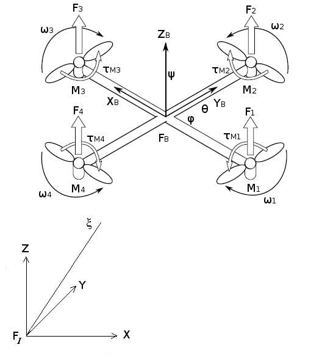

A Singularity-free Hierarchical Nonlinear Quad-Rotorcraft Control
using Saturation and Barrier Lyapunov Function

Ranjan Dasgupta1, Sayan Basu Roy2, Omkar Sudhir Patil3, and Shubhendu Bhasin3

Abstract— A singularity-free nonlinear hierarchical control
framework is proposed in this paper for control of a quad-
rotorcraft unmanned aerial vehicle (UAV). 

A saturation con-
trol scheme with hyperbolic tangent function is designed for
the position loop controller to ensure non-singular command
attitude extraction and the effect of nonlinear coupling between
the position and attitude subsystem is subsequently analyzed.
The problem of sign-ambiguity commonly appears in reference
attitude is overcome using arc tangent function by considering
the signs of both the arguments. 

To obviate the problem of
singularity during attitude tracking, a non-singular attitude
loop controller using barrier Lyapunov function (BLF) with
corresponding initial condition constraint is proposed. 

A rigor-
ous stability analysis proves that the overall closed-loop system
is asymptotically stable (AS) and all the signals are bounded in
the cascaded control structure. 

The singularity-free hierarchical
control development and its stability analysis exploits the full
state space Euler-Lagrange under-actuated dynamics in terms
of generalized coordinates with generalized force and torque
collocated with generalized velocities. 

Simulation results show
the performance of the proposed controller.

### I. INTRODUCTION
It is well understood that the under-actuated quad-
rotorcraft dynamics include a position and an attitude sub-
system where a virtual control input is considered for the
translational dynamics from which the command attitude
and thrust is obtained. 

The hierarchical nonlinear control
strategy [1]–[7], [19] requires desired attitude extraction
for attitude control from the designed thrust input of the
position subsystem. 

In [2], [3], [6] a multistage constructive
procedure exploits the cascade property of the translational
and rotational dynamics. 

A linear acceleration driving the
outer loop toward the desired trajectory is designed from
which a thrust and desired attitude is extracted to develop
the required torque for driving the inner loop toward the
command orientation. 

However, singularity is most likely
to occur during extraction. 

Successive differentiation of
virtual control input manifests a degeneracy problem if thrust
boundedness is not considered and thereby fails to provide
singularity-free reference attitude calculation. 

The widely
used saturation functions [8]–[10] for position loop control
design of the quad-rotorcraft are not smooth enough for
the subsequent design of attitude control loop based on the

1Ranjan Dasgupta is with the Innovation Lab, Tata Consultancy Services
Limited, India e-mail:ranjan.dasgupta@tcs.com
2Sayan Basu Roy is with the Department of Electronics and Communi-
cation Engineering, Indraprastha Institute of Information Technology Delhi,
New Delhi, India e-mail:sayan@iiitd.ac.in
3Omkar Sudhir Patil and Shubhendu Bhasin are with the Department of
Electrical Engineering, Indian Institute of Technology Delhi, New Delhi,
India e-mail:sbhasin@ee.iitd.ac.in

hierarchical strategy. 

Moreover, the attitude of the quad-
rotorcraft is represented with Euler angles where singularity
often occurs in the course of attitude tracking. 

Classical
attitude controllers [11]–[13] are developed on the assump-
tion that no such singularity happens. 

Quaternion based
approach [14], [15] has been used to avoid the singularity
problem of a quad-rotorcraft dynamics but applied only for
attitude stabilization. 

At the same time, since the desired
attitude is regarded as input to the rotational dynamics,
the attitude tracking error introduces a nonlinear coupling
between the two subsystems, whose effect on stability of the
overall system is of utmost importance. 

In [16] the position
and attitude loop control laws are designed based on smooth
saturation and a barrier Lyapunov function (BLF) where a
complete position and attitude tracking is achieved without
singularity but the effect of attitude error on position tracking
due to time-scale separation inherent to multi-rotor dynamics
is not analyzed.
The proposed work is a singularity-free hierarchical nonlin-
ear control design that uses Euler-Lagrange (E-L) dynam-
ics of a quad-rotorcraft to compute guidance and control
laws simultaneously. 

The E-L model considers generalized
forces and torques collocated with generalized velocities
and represents a full state-space under-actuated dynamics in
terms of generalized coordinates. 

Earlier works on control
hierarchy [1]–[7], [18] have pointed out the need, to use
a smooth saturation function at the time of designing a
virtual control input for position subsystem in order to avoid
the singularity problem which manifests from successive
differentiation during computation of reference attitude. 

It
also suggests to impose a strict constraint on the design
to ensure its vertical component should be strictly posi-
tive, otherwise desired pitch reaches ± π

2 and generates the
problem of attitude singularity while tracking the reference
trajectory. 

In such a case, velocity transformation matrix
degenerates and computed torque control input for attitude
tracking becomes unbounded. 

Therefore an output constraint
(pitch angle must be strictly less than ± π

2 ) requires to be
satisfied for all the time during attitude control to avoid
singularity. 

In order to address both the challenges, the
current outer loop position control is designed based on
a hyperbolic tangent function of the filtered-tracking error
whereas the inner attitude loop controller is developed using
BLF [17] with a proposed constraint on output and initial
condition. 

The saturated position and singularity-free attitude
control laws simultaneously ensure non-singular extraction
of desired attitude and trajectory tracking for the cascade
system. 

The problem of sign-ambiguity commonly appears

2019 American Control Conference (ACC)
Philadelphia, PA, USA, July 10-12, 2019

#### 978-1-5386-7926-5/$31.00 ©2019 AACC
3075
Authorized licensed use limited to: University of Florida. 

Downloaded on August 31,2025 at 08:18:44 UTC from IEEE Xplore. 

Restrictions apply.

---
*Page 2*

in reference attitude [1], [7], [16] calculation is overcome
using arc tangent function by considering the signs of both
the arguments. 

The Lyapunov stability analysis of the overall
system proves that the origin of position and orientation error
dynamics is asymptotically stable (AS) with the proposed
singularity-free control algorithms applied on both the sub-
systems.

### II. A QUAD-ROTORCRAFT MODEL- THE
EULER-LAGRANGE APPROACH
### The Lagrangian dynamics of a quad-rotorcraft is given by
M(qv) ¨qv +Vm(qv, ˙qv) ˙qv +`G = H(η)F
(1)`

where the pose qv =

ζ T
ηTT ∈R6 of a quad-rotorcraft
contains position and orientation vector (roll, pitch, and yaw
angles) of the body-fixed frame {FB} relative to inertial
frame {FI} expressed in {FI} i.e. 

`ζ =
`
x
y
z
T and `η =
`
φ
θ
ψ
T as shown in Fig.1. 

M(qv) ∈R6×6 represents
the mass-inertia matrix, Vm(qv, ˙qv) ∈R6×6 represents the
centripetal-coriolis matrix, G ∈R6 represents the constant
gravity vector are all expressed in {FI} whereas `F =

T
τ

∈R4 represents the wrench (force T ∈R and torque
τ ∈R3) input vector expressed in {FB}`. 

Each motor Mi

(`i=1(1)4)1 produces force Fi and T =
4
∑
i=1
Fi ∈R represents`

total thrust applied on the vehicle. 

The roll-torque (τφ) is a
differential function of (F2 ∼F4), the pitch-torque (τθ) is of

(F1 ∼F3) and the yaw torque τ`ψ =
4`
∑
`i=1
τMi ∈R where τMi
is the reaction torque of motor Mi due to shaft acceleration
and blades drag`. 

Total input torque acting on the vehicle is
represented by `τ =
`
τφ
τθ
τψ
T ∈R3. 

The matrix

Fig. 1.
Quad-Rotorcraft

H(η) ∆=





(cφsθc`ψ +sφsψ`)
0
0
0
(cφsθsψ −sφcψ)
0
0
0
cφcθ
0
0
0
0
1
0
0
0
0
cφ
−sφ
0
−sθ
cθsφ
cθcφ





#### ∈R6×4
is
the
mapping
between
the
external
forces/torques
F ∈R4 acting on the vehicle and the generalized wrench.
Here s(.) and c(.) are defined as s(.)
∆= sin(.) and c(.)
∆= cos(.).

1The notation "`i=a(m)b" implies that "i=a,a+m,a+2m,`...,b".

Equation (1) shows that quad-rotorcraft is an under-actuated
mechanical system (UMS) having two connected subsystems
1) position subsystem and 2) attitude subsystem.

### A. Position Subsystem
Using (1) the dynamics of the position subsystem is given
by

Mq ¨`ζ + `¯`G = R(η)TezT = Tv
(2)`

where Mq = mqI ∈R3×3 represents mass-matrix (mq = mass
of the quad-rotorcraft, I ∈R3×3, denotes an identity matrix),
¯`G =

0
0
mqg
T ∈R3 represents the reduced order gravity
vector, R(η) is the rotation matrix between {FB} & {FI}, ez
is the Cartesian basis vector of {FI} along z direction, and
computed thrust control Tv =
Tvx
Tvy
Tvz
T ∈R3 where
Tvx, Tvy, Tvz are the scalar components of Tv along XYZ axes`.
Equation (2) in matrix form is given by



mq
0
0
0
mq
0
0
0
mq

### 
### 
### 
### 
¨x
¨y
¨z
### 
### +
### 

0
0
mqg

### 
### =
### 

(cφsθc`ψ +sφsψ`)T
(cφsθsψ −sφcψ)T
cφcθT

### 
### 
### (3)
### B. Attitude Subsystem
Using (1) the dynamics of the attitude subsystem is given
by

Mη(η) ¨`η +Vη`(η, ˙η) ˙`η = J`(η)Tτ
(4)

where
Mη(η)
∈
R3×3
represents
inertia
tensor,
Vη(η, ˙η) ∈R3×3 represents the reduced order centripetal-
coriolis matrix,

### J(η) =
### 

1
0
−sθ
0
cφ
cθsφ
0
−sφ
cθcφ

### 
### represents velocity transformation
### matrix.
Property 1. The matrix
 ˙Mη(η)−2Vη(η, ˙η)

∈so(3) 2

i.e.
 ˙Mη(η)−2Vη(η, ˙η)
`T = -
 ˙Mη(η)−2Vη(η, ˙η)

and
therefore, vT  ˙Mη(η)−2Vη(η, ˙η)

v = 0 ∀v ∈R3`

From (2) and (4) the respective terms of the matrices in
(1) are represented as follows

M(qv) =

Mq
03×3

03×3
Mη(η)


, Vm(qv, ˙qv) =

03×3
03×3

03×3
Vη(η, ˙η)

### 
,
`G =
 ¯G
0
0
0
T and H(η) =

R(η)Tez
03×3`

03×1
J(η)T

### 
.
The following section proposes a nonlinear hierarchical
control law design for attitude and position subsystem.

### III. DESIGN OF CONTROL HIERARCHY
The objective is to design a flight controller by exploiting
the structural properties of rotorcraft model to simultaneously

2Often denoted as a group of 3×3 skew-symmetric matrix

#### 3076
Authorized licensed use limited to: University of Florida. 

Downloaded on August 31,2025 at 08:18:44 UTC from IEEE Xplore. 

Restrictions apply.

---
*Page 3*
control the position and orientation dynamics of the quadro-
tor. 

A hierarchical nonlinear control is used where the inner-
loop performs attitude tracking and generates the required
torques whereas the outer-loop generates the thrust and the
reference attitude, required to follow a desired trajectory
ζd =

xd
yd
zd
T. 

The developed thrust control input
is bounded to ensure singular-free extraction of reference
roll and pitch of the quad-rotorcraft i.e. 

{φd(t),θd(t)} ∈

−π

2 , π

2

, ∀`t ≥0 whereas a BLF based attitude control law is
designed to ensure pitch angle θ(t) ∈

−π`

2 , π

2

. 

The problem
of sign-ambiguity appears in reference attitude is overcome
using arc tangent function by considering the signs of both
the arguments.

A. 

Position Control Design
The objective is to develop a position tracking controller
for the quad-rotorcraft dynamics given by (2). 

The position
error is defined as eζ(t) = ζd −`ζ =
`
ex
ey
ez
T ∈R3. 

The
order of the dynamic expression given in (2) is subsequently
reduced to facilitate the control development by defining a
filtered tracking error-like variable rζ(t) ∈R3 as

r`ζ = `˙e`ζ +αζTanh`(eζ)+Tanh(ef )
(5)

where αζ ∈R+ represents a filter gain and to aid the
subsequent control design and analysis, the vector, matrix
functions Tanh(.),Cosh(.),Sech(.) are defined as
Tanh(v) ∆=

tanh(v1)
tanh(v2)
tanh(v3)
T ∈R3,

Cosh(v) ∆= diag{cosh(v1),cosh(v2),cosh(v3)} and
Sech(v) ∆=Cosh−1(v) ∈R3×3 where `v =

v1
v2
v3
T ∈R3`.

An auxiliary filter variable ef
∆=
efx
efy
efz

∈R3 is
defined to have the following dynamics

˙ef = Cosh2(e f )(−kζr`ζ +Tanh`(eζ)−γζTanh(e f ))
(6)

where ef (0) = 0 and {kζ,γζ} ∈R+ are constants.

Remark 1. 

The choice of filter variables in (5) and (6)
are instrumental to provide singularity-free reference attitude
calculation.

Taking the time derivative of (5), pre-multiplying the
resulting expression by Mq, substituting (2) and second time
derivative of eζ(t), the open-loop position error system for
rζ(t) is formulated as

Mq ˙r`ζ = Mq` ¨ζd −Mqkζr`ζ +MqTanh`(eζ)+αζMqSech2(eζ) ˙eζ
−γζMqTanh(ef )+ ¯G−Tv
= Mq ¨ζd −Mqkζr`ζ +MqTanh`(eζ)+ `χ + `¯G−Tv
(7)

where χ ∆= αζMqSech2(eζ) ˙eζ −γζMqTanh(ef ). 

Assume the
open-loop position error system can be stabilized by a
smooth virtual control law Td. 

Adding and subtracting Td
on the right-hand side of (7), the equivalent representation
of open-loop position error dynamics is obtained as

Mq ˙r`ζ = Mq` ¨ζd −Mqkζr`ζ +MqTanh`(eζ)+ `χ + `¯G

−(Tv −Td)−Td
= Mq ¨ζd −Mqkζr`ζ +MqTanh`(eζ)+ `χ + `¯G−Te −Td
(8)

where Te
∆= Tv −Td denotes the error between actual and
desired thrust.

Remark 2. 

Quad-rotorcraft dynamics has additional posi-
tion control input which differs from classical back-stepping
design where there is one control and rest are virtual inputs.

Based on the resulting system in (8), Td is designed as

Td = Mq ¨ζd +2MqTanh(eζ)−kζMqTanh(ef )+ ¯G
(9)

assuming the dynamics is exactly known and kζ ∈R+
represents a control gain. 

Substituting (9) into (8), the closed-
loop error dynamics is given by

Mq ˙r`ζ = `−Mqkζrζ −MqTanh(eζ)+kζMqTanh(e f )+ χ −Te (10)

### B. Attitude Reference Calculation
Using (3) the following set of equations are derived as

mq ¨`x = (cφsθc`ψ +sφsψ`)T
(11)`

mq ¨`y = (cφsθsψ −sφcψ)T
(12)`

mq¨z+mqg = cφcθT
(13)

From above equations the scalar components of Td =

Txd
Tyd
Tzd
T ∈R3 on {X,Y,Z} axes, are defined as

Txd
∆= (cφdsθdcψd +sφdsψd)T
(14)

Tyd
∆= (cφdsθdsψd −sφdcψd)T
(15)

Tzd
∆= cφdcθdT
(16)

where φd, θd, ψd are the desired attitude of the vehicle and


Td


 =
q

T 2xd +T 2yd +T 2zd = T
(17)

Using (14), (15), and (16) the desired roll and pitch angles
(φd,θd) are computed as

φd = arctan((Txd sψd −Tyd cψd )/
q

(Txd cψd +Tyd sψd )2 +T 2zd), φd ∈

−π

2 , π

2


### (18)
θd = arctan((Txd cψd +Tyd sψd )/Tzd), θd ∈

−π

2 , π

2

(19)

They are given as reference inputs to the attitude subsystem
for any user-supplied fixed yaw angle ψd.

Proposition 1. 

A stricter requirement should be imposed
on the gain parameter of position loop controller in order
to ensure Tzd ̸= 0, ∀`t ≥0 for non-singular extraction of
reference roll and pitch of the quad-rotorcraft`. 

The desired
acceleration ¨ζd =

¨xd
¨yd
¨zd
T must be bounded and
satisfies the condition
¨zd
 ≤ε <g-2,
`t ≥0, where ε is a
positive scalar quantity`. 

It implies that the magnitude of the
Z-component of desired acceleration should be less than g-2.
Moreover to ensure the desired thrust is strictly positive, the
controller parameter kζ satisfies the following constraint

kζ < g−ε −2
(20)

### Extracting the third row of (9) and using (20)
Tzd = mq¨zd +2mq tanh(ez)−kζmqtanh(efz)+mqg
(21)

#### 3077
Authorized licensed use limited to: University of Florida. 

Downloaded on August 31,2025 at 08:18:44 UTC from IEEE Xplore. 

Restrictions apply.

---
*Page 4*
### the mass normalized vertical thrust control input,
uzd = ¨zd +2tanh(ez)−kζtanh(e fz)+g

### ≥−ε −2−kζ +g > 0
(22)
uzd is strictly positive ∀`t ≥0`. 

In this case, the command roll
φd and pitch θd can be extracted via (18) and (19) without
singularity.

### C. Singularity-free Attitude Control Design
The
objective
is
to
develop
an
output
constrained
attitude tracking controller for the quad-rotorcraft dy-
namics given by (4). 

The attitude error is defined as
eη(t) = ηd −`η =
`
eφ
eθ
eψ
T ∈R3 where ηd(t) =

φd(t)
θd(t)
ψd(t)
T ∈R3 denotes the desired attitude.
The order of the dynamic expression given in (4) is subse-
quently reduced to facilitate control development by defining
a filtered tracking error-like variable rη(t) ∈R3

r`η = `˙e`η +Aηeη`
(23)

where A`η
= diag`{αη11,αη22,αη33} ∈R3×3, αηii ∈R+,
`i=1(1)3 is a positive-definite constant control gain matrix`.
Taking the time derivative of (23), pre-multiplying the re-
sulting expression by Mη(η), substituting (4) and second
time derivative of eη(t), the open-loop attitude error system
for rη(t) is formulated as

Mη(η)˙r`η = Mη`(η) ¨ηd +Mη(η)Aη ˙e`η +Vη`(η, ˙η) ˙η −J(η)Tτ (24)

Based on the open-loop attitude error system in (24) a
computed torque control τ is designed as

`τ = J`(η)−T(Mη(η) ¨ηd +Mη(η)Aη ˙e`η +Vη`(η, ˙η) ˙`η+`

Vη(η, ˙η)r`η +Kηrη` +e`η + `¯η)
(25)

assuming the dynamics is exactly known, Kη ∈R3×3 rep-
resents a positive diagonal control gain matrix and ¯η
∆=

eφ
e`θ/`(k2
θ −e2
θ )
eψ
T ∈R3 where the attitude control gain
kθ(t) ∈R is chosen such that

kθ(t) = `π/2`−
θd(t)

(26)

and
eθ(0)
 < kθ(0). Substituting (25) into (24) the closed-
loop error system is determined as

Mη(η)˙r`η +Vη`(η, ˙η)r`η +Kηrη` +e`η + `¯`η = 0`
(27)

### D. Attitude Error Characterization
Equation (8) indicates that Tv can be realized with certain
errors. 

Using (3), (11), (12), (13), and eη(t) expressions for
Tvx, Tvy, and Tvz are as follows

Tvx = (c(φd−eφ )s(θd−eθ )c(ψd−eψ) +s(φd−eφ )s(ψd−eψ))T
(28)

Tvy = (c(φd−eφ )s(θd−eθ )s(ψd−eψ) −s(φd−eφ )c(ψd−eψ))T
(29)

Tvz = c(φd−eφ )c(θd−eθ )T
(30)

Using trigonometric identities3 (28) can be rewritten as

Tvx = (cφd sθd cψd +sφd sψd )T +(2(sθd cψd s(φd−e`φ/2`)se`φ/2`

−cφd cψd s(θd−e`θ/2`)se`θ/2` +cφd sθd s(ψd−e`ψ/2`)se`φ/2`)

−4(cψd s(φd−e`φ/2`)c(θd−e`θ/2`)se`φ/2seθ`/2 −sθd s(φd−e`φ/2`)s(ψd−e`ψ/2`)se`φ/2seψ`/2

+cφd c(θd−e`θ/2`)s(ψd−e`ψ/2`)se`θ/2seψ`/2)

−8s(φd−e`φ/2`)c(θd−e`θ/2`)s(ψd−e`ψ/2`)se`φ/2seθ`/2se`ψ/2`)T

= (cφd sθd cψd +sφd sψd )T +hx(φd,θd,ψd,eφ,eθ,eψ)T

= Txd +hx(ηd,eη)T
(31)

### Similarly (29) and (30) reduces to
Tvy = Tyd +hy(ηd,eη)T
(32)

Tvz = Tzd +hz(ηd,eη)T
(33)

where hx, hy and hz are the nonlinear coupling terms between
the position and attitude subsystem, consisting of sine and
cosine functions of the desired attitude and their errors. 

The
computed thrust control Tv is designed as

Tv −Td = Te = Th =


Td


h
(34)

where `h =

hx
hy
hz
T ∈R3`

### IV. STABILITY ANALYSIS
Stability of the complete system is analyzed using a
hierarchical control design in presence of a strong nonlinear
coupling between the two subsystems.

Lemma 1. 

Based on the definition of (26) and considering
bounded thrust derivatives
˙k`θ/kθ`
 ≤υ where υ is a finite
bound 4 on the interval θd(t) ∈

−π

2 , π

2


Lemma 2. 

For a bounded second derivative of position
reference ζd(t), using (9)


Td


 ≤c where c is a positive

scalar and defined as, c ∆= (c1 +c2), c1
∆= (k1k2 +k3), c2
∆=
(k`ζ +2`)k1
√

3, k1
∆=


Mq


F, k2
∆=


 ¨ζd


, k3
∆=


 ¯G

It is noted that


.


F denotes Frobenius norm of the
argument matrix and it is derived from (9) using (5) and
subsequently applying norm inequalities.

Lemma 3.


`h


 ≤α


eη


, where eη(t) is the attitude-
tracking error vector and α is a positive constant`.

It is derived from the expressions of hx(ηd,eη), hy(ηd,eη)
and hz(ηd,eη) appear in (31), (32) and (33) and applying
trigonometric identities 5 and norm inequalities.

3The following trigonometric identities are applied to obtain (31), (32)
and (33) respectively where {x,y} ∈R.

cos(x−y) = cos(x)+2sin(x−y/2)sin(y/2)
sin(x−y) = sin(x)−2cos(x−y/2)sin(y/2)

4It can be ensured through the strictly less than condition in (20)
5The following inequalities are applied to prove the lemma.
sin(x)
,
cos(x)
 ≤1
sin(x)
 ≤
x
 ∀x ∈(−`π/2`, `π/2`)
sin(x−y

2)sin( y

2)
,
cos(x−y

2 )sin( y

2 )
 ≤
sin( y

2)

#### 3078
Authorized licensed use limited to: University of Florida. 

Downloaded on August 31,2025 at 08:18:44 UTC from IEEE Xplore. 

Restrictions apply.

---
*Page 5*
Lemma 4. The term χ can be upper bounded as


χ


 ≤

δ


zζ


, where zζ
∆=
h
rT
ζ
TanhT(eζ)
TanhT(ef )
iT
∈R9

### and δ is a positive constant.
It is derived from the previous definition of χ term and
subsequently using (6) and norm inequalities.
The above lemmas6 will be instrumental in proving the main
theorem.

Theorem 5. 

For the system in (1), the position control law
in (9) with the attitude control law in (25) guarantee that the

overall error dynamics ev(t) =
h
eT
ζ
eT
η
iT
is asymptotically
stable provided the following gain conditions are satisfied

kkζ2 > δ 2/4λmin{Mq}

λmin{Aη} > max

β 2/4kζ3λmin{Mq},2υ

(35)

where λmin represents minimum eigenvalue of the argument
matrix and (k,kζ2,kζ3,β) are subsequently defined auxiliary
positive scalar constants subjected to an initial condition
constraint
eθ(0)
 < kθ(0).

### Proof. Consider a Lyapunov function candidate as
L(t) = Lζ(t)+Lη(t)

=

1/2rT
ζ Mqr`ζ +mq`

lncosh(ex)+lncosh(ey)+lncosh(ez)


+ 1/2TanhT(ef )MqTanh(ef )

+

1/2rT
ηMη(η)r`η + 1`/2eT
ηe`η
+ 1`/2

e2
`φ +ln`

k2
`θ/`(k2
θ −e2
θ )

+e2
ψ

(36)

For simplicity consider Lζ(t) at first

Lζ(t) = 1/2rT
ζ Mqr`ζ +mq`

lncosh(ex)+lncosh(ey)

+lncosh(ez)

+ 1/2TanhT(e f )MqTanh(ef )
(37)

Differentiate (37), substitute (6) and (10) and canceling like
terms, results

˙Lζ(t) = −kζrT
ζ Mqrζ −rT
ζ Te −αζTanhT(eζ)MqTanh(eζ)

−γζTanhT(ef )MqTanh(ef )+rT
ζ χ
(38)

Again consider Lη(t)

Lη(t) =
1/2rT
ηMη(η)r`η + 1`/2eT
ηe`η + 1`/2

e2
`φ +ln`

k2
`θ/`(k2
θ −e2
θ )

+e2
ψ


### (39)
Differentiate (39), substitute (23) and (27), apply Property 1,
and canceling like terms, results

˙Lη(t) = −rT
ηKηrη −eT
ηAηeη −¯ηTAηeη −˙kθ e2
`θ/kθ` (k2
θ −e2
θ ) (40)

Add (38) and (40), use (34), apply Lemma 1-4, and subse-
quently upper bound the resulting expression yields

˙L(t) ≤−kζλmin{Mq}


rζ


2

−αζλmin{Mq}


Tanh(eζ)


2 −γζλmin{Mq}


Tanh(ef )


2

−λmin{Kη}


rη


2 −λmin{Aη}


eη


2

−λmin{Aη}

e2
`φ + e2`
`θ/`(k2
θ −e2
θ )+e2
ψ


+ `υ/`(k2
θ −e2
θ )e2
`θ +


rζ`


αc


e`η


+


rζ`


δ


zζ


(41)

6The detailed proofs of Lemma 1−4 are not provided here to honor the
page limit and will be reported in the future publication of the authors.

Define kζ
∆= (kζ1 +kζ2 +kζ3), β
∆= αc, and completing the
squares, (41) becomes

˙L(t) ≤−k


rζ


2 +


Tanh(eζ)


2 +


Tanh(e f )


2 

−kζ2λmin{Mq}


rζ


−δ



zζ

/2kζ2λmin{Mq}
2

+ δ 2


zζ

2/4kζ2λmin{Mq}

−kζ3λmin{Mq}


rζ


−β



e`η



/2kζ3λmin`{Mq}
2

+ β 2


eη



2/4kζ3λmin{Mq}

−λmin{Kη}


rη


2 −λmin{Aη}


eη


2

−λmin{Aη}

e2
`φ + e2`
`θ/`(k2
θ −e2
θ )+e2
ψ

+ `υ/`(k2
θ −e2
θ )e2
θ
(42)

where k
∆= min

kζ1λmin{Mq},αζλmin{Mq},γζλmin{Mq}

.
Further upper bounding on (42) results

˙L(t) ≤−

k −δ 2/4kζ2λmin{Mq}


zζ


2 −λmin{Kη}


rη


2

−

λmin{Aη}−β 2/4kζ3λmin{Mq}


eη


2

−λmin{Aη}/2(k2
θ −e2
θ )

1−2`υ/λmin`{Aη}

e2
θ
−λmin{Aη}

e2
`φ + e2`
`θ/2`(k2
θ −e2
θ )+e2
ψ

(43)

### Imposing the gain condition (35) on (43) yields
˙L(t) ≤−ka


zζ


2 −λmin{Kη}


rη


2

−min

kb,λmin{Aη}kc/2(k2
θ −e2
θ )

e2
θ
−λmin{Aη}

e2
`φ + e2`
`θ/`(k2
θ −e2
θ )+e2
ψ

(44)

negative-definite (ND) result and the error dynamics is AS
where ka
∆=

k −δ 2/4kζ2λmin{Mq}

> 0, kb
∆=

λmin{Aη} −

β 2/4kζ3λmin{Mq}

> 0 and kc
∆=

1−2`υ/λmin`{Aη}

> 0
In view of (36)

1/2ln

k2
`θ/`(k2
θ −e2
θ )

≤L(0) < ∞

=⇒

k2
`θ/`(k2
θ −e2
θ )

≤e2L(0) =⇒e2
`θ/k2`
θ ≤1−e−2L(0)

i.e. e2
`θ/k2`
θ < 1 =⇒
eθ(t)
 < kθ(t) ∀`t ≥0
(45)`

Using eη(t) and applying the definition (26), ∀`t ≥0
θ(t)
 ≤
θd(t)
+
eθ(t)
 <
θd(t)
+kθ(t) = `π/2`
(46)`

### ■
Remark 3. 

With the help of BLF, (45) proves that eθ(t) is
strictly less than kθ(t) for all the time provided the initial
condition constraint is satisfied. 

Using above result, (46)
restricts pitch angle
θ(t)
 < ±`π/2` and singularity is avoided.

### V. SIMULATION RESULTS
The control hierarchy developed in presence of nonlinear
coupling between position and attitude subsystem of a quad-
rotorcraft has been tested on a simulated environment. 

The
list of model parameters used to verify the design are mq
= 468g, moment of inertia along {XB,YB,ZB} axes are Ixx
= 4.9, Iyy = 4.9 and Izz = 8.8g.m2. 

Control and filter gains
are k`ζ = αζ` = γ`ζ = 1`, and K`η = Aη` = diag(100,100,100).
The reference trajectory is defined as xd = cos(t), yd =

#### 3079
Authorized licensed use limited to: University of Florida. 

Downloaded on August 31,2025 at 08:18:44 UTC from IEEE Xplore. 

Restrictions apply.

---
*Page 6*
sin(t), zd = t 7 and ψd = 0. 

Fig. 

2 and 3 exhibits position
and attitude tracking performance of the controller. 

Result
shows singularity-free reference pitch extraction and actual
pitch lies in {(−`π/2`,`π/2`)−blueline}, during attitude tracking.
Thrust components on {X,Y,Z} axes are shown in Fig. 

4.

time (sec)
0
5
10
15
20

x → x d (m)

-2

0

2
x position tracking

xd
x

time (sec)
0
5
10
15
20

y → y d (m)

-2

0

2
y position tracking

yd
y

time (sec)
0
5
10
15
20

z → zd (m)

0

10

20
z position tracking

zd
z

Fig. 2.
Position Tracking

time (sec)
0
5
10
15
20

φ →φd (rad)

-2

0

2
roll tracking

φd
φ

time (sec)
0
5
10
15
20

θ →θd (rad)

-2

0

2
pitch tracking

θd
θ

time (sec)
0
5
10
15
20

ψ →ψd (rad)

-0.5

0

0.5
yaw tracking

ψd
ψ

Fig. 3.
Attitude Tracking

time (sec)
0
5
10
15
20

Tv
x
 (N)

-5

0

5
Thrust along x-direction

time (sec)
0
5
10
15
20

Tv
y
 (N)

-10

0

10
Thrust along y-direction

time (sec)
0
5
10
15
20

Tv
z
 (N)

0

5

10
Thrust along z-direction

Fig. 4.
Thrust along {X,Y,Z} axes

### VI. CONCLUSIONS
A singularity-free hierarchical control is proposed for
trajectory tracking of a quad-rotorcraft. 

A saturation con-
trol using hyperbolic tangent function is designed for the
position loop controller to ensure non-singular command
attitude extraction. 

An attitude loop controller using BLF
satisfying output and initial condition constraints is proposed
to eliminate singularity problem during attitude tracking. 

The
effect of nonlinear coupling between the position and attitude

7Mathematically it is unbounded but in practice the vehicle will always
be at altitude lock position after arising a certain height.

subsystem is considered and the rigorous analysis proves that
the overall closed-loop system is asymptotically stable. 

The
design can be used in any quadrotor [20] applications.

### REFERENCES
[1] A. 

Das, F. 

Lewis, and K. 

Subbarao, "Backstepping approach for
controlling a quadrotor using lagrange form dynamics," Journal of In-
telligent and Robotic Systems, vol. 

56, no. 

1, pp. 

127-151, September.
2009.
[2] A. 

Abdessameud and A. 

Tayebi, "Global trajectory tracking control
of vtol-uavs without linear velocity measurements," Automatica, vol.
46, no. 

6, pp. 

1053-1059, June. 

2010.
[3] A. 

Roberts and A. 

Tayebi, "Adaptive Position Tracking of VTOL
UAVs," IEEE Transactions on Robotics, vol. 

27, no. 

1, pp. 

129-142,
February. 

2011.
[4] G. 

P. 

Falconi, O. 

Fritsch, B. 

Lohmann, and F. 

Holzapfel, "Admissible
thrust control laws for quadrotor position tracking," Proceedings of
the 2013 American Control Conference, Washington, DC, June 2013,
pp. 

4844-4849.
[5] A. 

Roza and M. 

Maggiore, "A class of position controllers for
underactuated vtol vehicles," IEEE Transactions on Automatic Control,
vol. 

59, no. 

9, pp. 

2580-2585, Sept. 

2014.
[6] R. 

Naldi, M. 

Furci, R. 

G. 

Sanfelice, and L. 

Marconi, "Robust global
trajectory tracking for underactuated vtol aerial vehicles using inner-
outer loop control paradigms," IEEE Transactions on Automatic Con-
trol, vol. 

62, no. 

1, pp. 

97-112, January. 

2017.
[7] Y. 

Yildiz, M. 

Unel, and A. 

E. 

Demirel, "Nonlinear hierarchical control
of a quad tilt-wing uav: An adaptive control approach," International
Journal of Adaptive Control and Signal Processing, vol. 

31, no. 

9,
pp.1245-1264, September. 

2017.
[8] Andrew R. 

Teel, "Global stabilization and restricted tracking for mul-
tiple integrators with bounded controls," Systems & Control Letters,
vol. 

18, no. 

3, pp. 

165-171, March. 

1992.
[9] Bin Zhou, Guang-Ren Duan, "Global stabilization of linear systems
via bounded controls," Systems & Control Letters, vol. 

58, no. 

1, 2009,
pp. 

54-61, January. 

2009.
[10] Jinchang Hu, Honghua Zhang, "Immersion and invariance based
command-filtered adaptive backstepping control of VTOL vehicles,"
Automatica, vol. 

49, no. 

7, pp. 

2160-2167, July. 

2013.
[11] Guilherme V. 

Raffo, Manuel G. 

Ortega, Francisco R. 

Rubio, "An
integral predictive/nonlinear H∞control structure for a quadrotor
helicopter," Automatica, vol. 

46, no. 

1, pp. 

29-39, January. 

2010.
[12] Z. 

Zuo and P. 

Ru, "Augmented L1 adaptive tracking control of quad-
rotor unmanned aircrafts," in IEEE Transactions on Aerospace and
Electronic Systems, vol. 

50, no. 

4, pp. 

3090-3101, October. 

2014.
[13] Z. 

Zuo and C. 

Wang, "Adaptive trajectory tracking control of output
constrained multi-rotors systems," IET Control Theory & Applications,
vol. 

8, no. 

13, pp. 

1163-1174, September. 

2014.
[14] S. 

Zhao, W. 

Dong and J. 

A. 

Farrell, "Quaternion-based trajectory track-
ing control of VTOL-UAVs using command filtered backstepping,"
Proceedings of the 2013 American Control Conference, Washington,
DC, June 2013, pp. 

1018-1023.
[15] H. 

Liu, X. 

Wang and Y. 

Zhong, "Quaternion-Based Robust Attitude
Control for Uncertain Robotic Quadrotors," IEEE Transactions on
Industrial Informatics, vol. 

11, no. 

2, pp. 

406-415, April. 

2015.
[16] Y. 

Zou and W. 

Huo, "Nonlinear Robust Controller for Miniature
Helicopters Without Singularity," in IEEE Transactions on Aerospace
and Electronic Systems, vol. 

53, no. 

3, pp. 

1402-1411, June. 

2017.
[17] Keng Peng Tee, Shuzhi Sam Ge and Eng Hock Tay, "Barrier Lyapunov
Functions for the control of output-constrained nonlinear systems,"
Automatica, vol. 

45, no. 

4, 2009, pp. 

918-927, April. 

2009
[18] T. 

Lee, M. 

Leok and N. 

H. 

McClamroch, "Geometric tracking control
of a quadrotor UAV on SE(3)," Proceedings of the 49th IEEE
Conference on Decision and Control, Atlanta, GA, 2010, pp. 

5420-
5425.
[19] R.Dasgupta,"Adaptive Attitude Tracking of a Quad-Rotorcraft Using
Nonlinear Control Hierarchy," 2018 IEEE Recent Advances in Intelli-
gent Computational Systems (RAICS), India, 2018, pp. 

177-181
[20] R. 

Dasgupta, R. 

Mukherjee and A. 

Gupta, "A novel approach of sensor
data retrieving using a quadcopter in wireless sensor network forming
concentric circular topology," 2015 6th International Conference on
Automation, Robotics and Applications (ICARA), Queenstown, 2015,
pp. 

238-245

#### 3080
Authorized licensed use limited to: University of Florida. 

Downloaded on August 31,2025 at 08:18:44 UTC from IEEE Xplore. 

Restrictions apply.

